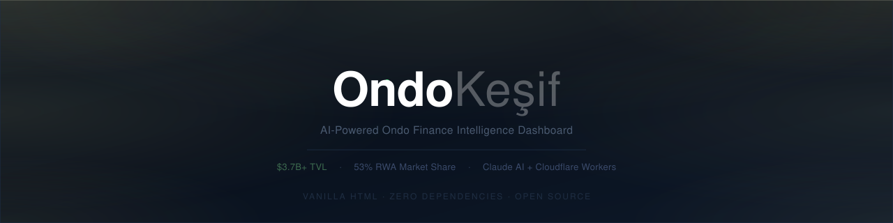

<div align="center">



<br>

[](https://zideofturkey.github.io/ondo-kesif)&nbsp;
[](https://anthropic.com)&nbsp;
[](https://workers.cloudflare.com)&nbsp;
[](https://pages.github.com)

</div>

<br>

## What is this?

**OndoKeşif** is a single-page intelligence dashboard for tracking **Ondo Finance (ONDO)** — the leading real-world asset (RWA) tokenization protocol with $3.7B+ TVL and 53% market share in tokenized equities (BlackRock, Goldman Sachs, NYSE, Binance).

The site adapts content depth to the viewer: a **Beginner mode** explains tokenization and on-chain concepts from scratch, while **Expert / Investor mode** surfaces technical context, protocol economics, and institutional data.

<br>

## Features

#### 📡 &nbsp; Live Market Data
- Real-time ONDO price (24h Δ) via **CoinGecko API**, auto-refreshes every 60 seconds
- Performance popup: daily / weekly / monthly / 2-month / 6-month / 1-year returns
- BTC, ETH, SOL comparison with full performance breakdowns in the same popup
- Market opportunity cards from **DeFiLlama API** — live TVL, RWA market share, protocol count

#### 🤖 &nbsp; AI-Powered News Analysis
- One click: Claude searches the web and explains **why ONDO is moving today**
- Identifies the catalyst type — news-driven, market-driven, technical recovery, or unknown
- Compares ONDO against BTC / ETH / SOL — surfaces correlation and divergence
- Market context (24h volume, 7-day returns) sent to Claude for grounded analysis
- Secured via **Cloudflare Worker** — API key never touches the frontend
- Daily usage limit with admin override

#### 🎨 &nbsp; Design
- Minimal dark theme (`#090909`) that shifts into a **premium expert atmosphere** on mode toggle — navy gradient background, warm golden edge glows, animated corner hotspots
- Smooth scroll-triggered section reveals, sticky progress bar
- Mobile-first: price popup becomes a bottom sheet, navigation collapses into a side panel

#### 🏛️ &nbsp; Content
- Full Ondo Finance explainer — tokenization, on-chain settlement, product suite (USDY, OUSG, OGM)
- 10 institutional partners with expandable detail panels (shimmer effect)
- Milestone timeline: NYSE 7/24, Solana integration, BitGo IPO, Binance partnership, SEC closure
- Regulation tracker: SEC, GENIUS Act, KYC/AML compliance status
- Honest risk section: token vesting schedule, macro factors

<br>

## Tech Stack

| Layer | Technology | Notes |
|---|---|---|
| Frontend | Vanilla HTML + CSS + JS | No frameworks, no build step |
| Live Price | CoinGecko API | ONDO, BTC, ETH, SOL — 24h + 7d |
| TVL & RWA Market | DeFiLlama API | Live TVL, protocol list, share calc |
| AI Analysis | Anthropic Claude (Haiku) | Web search tool enabled |
| API Security | Cloudflare Workers | Serverless proxy, encrypted env var |
| Hosting | GitHub Pages | Single file deploy |

> Built as a single `index.html`. No bundler, no package manager, no runtime dependencies — except the Cloudflare Worker that keeps the API key off the client.

<br>

## How the AI Analysis Works

```
User clicks "Analiz Et"
        ↓
Confirmation popup — daily limit check (localStorage)
        ↓
Frontend bundles market context:
  ONDO, BTC, ETH, SOL → 24h change, 7d change, volume
  Current TVL from DeFiLlama
        ↓
POST → Cloudflare Worker (API key in encrypted env, never in HTML)
        ↓
Worker → Anthropic API (Claude Haiku + web_search tool)
        ↓
Claude runs two searches:
  "Ondo Finance news this week"
  "ONDO token price movement reason today"
        ↓
Returns structured JSON:
  · summary     (Turkish, 2-3 sentences)
  · catalyst    (news_driven | market_driven | technical_recovery | unknown)
  · news[]      (up to 6 cards: title, source, date, url, impact)
  · comparison  (ONDO vs BTC/ETH/SOL — correlation or divergence, Turkish)
        ↓
Rendered with catalyst badge, market strip, comparison block
```

<br>

## Setup

No setup needed to browse locally — just open `index.html`.

To enable AI analysis:

```
1. Anthropic API key  →  console.anthropic.com/settings/keys
2. Cloudflare account →  workers.cloudflare.com  (free tier)

   Deploy ondo-worker.js as a Worker
   Add ANTHROPIC_API_KEY as encrypted environment variable
   Update WORKER_URL in index.html
```

<br>

## Project Background

Started as a Gemini-generated prototype, rebuilt feature by feature into a full intelligence dashboard. Core additions: real-time data layer, AI analysis engine with Cloudflare proxy, performance popup, expert mode atmospheric design (CSS `@property` animations, conic gradients, golden edge glows), and a complete mobile experience.

<br>

---

<div align="center">
<br>

Built by &nbsp;**[Ediz Kaçmaz](mailto:ediz@edizkacmaz.com)**

<sub>Eğitim ve bilgi amaçlıdır &nbsp;·&nbsp; Yatırım tavsiyesi değildir</sub>

</div>
